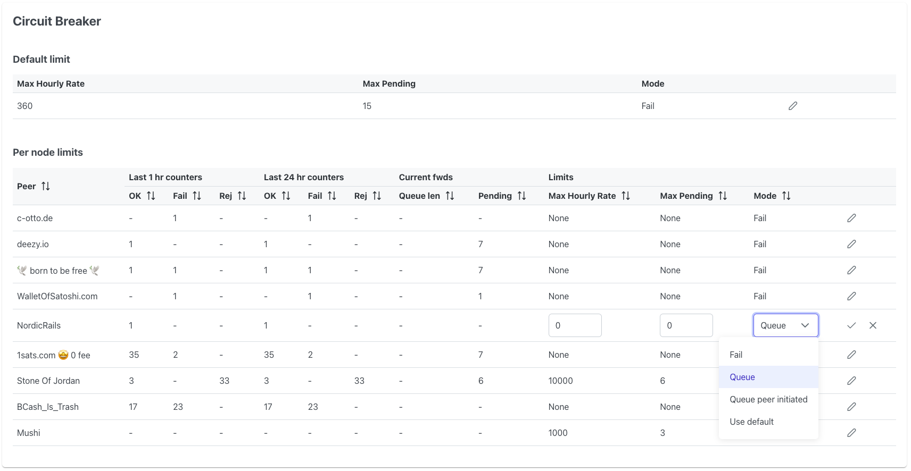

# Circuit Breaker

`circuitbreaker` is to Lightning what firewalls are to the internet.

It allows nodes to protect themselves from being flooded with htlcs. With
`circuitbreaker` a maximum to the number of in-flight htlcs can be set on a
per-peer basis. Known and trusted peers for example can be assigned a higher
maximum, while a new channel from a previously unseen node may be limited to
only a few pending htlcs.

Furthermore it is possible to apply rate limits to the number of forwarded
htlcs. This offers protection against DoS/spam attacks that rely on large
numbers of fast-resolving htlcs. Rate limiting is implemented with a [Token
bucket](https://en.wikipedia.org/wiki/Token_bucket). Via the UI the
minimum interval between htlcs can be specified.

Large numbers of htlcs are also required for probing channel balances. Reducing the
information leakage through probing could be another reason to put in place a
rate limit for untrusted peers.

## Why are limits needed?

In today's Lighting Network payments are routed via a series of hops. Each of
those hops will incur a cost for forwarding that payment. While the htlc of an
hop is in-flight, the associated amount is locked in the hop's outgoing channel.
Those funds cannot be used for another purpose. This can be considered to be an
opportunity cost.

Furthermore each channel has a limited number of htlc 'slots'. The current
maximum is 483 slots. This means that regardless of channel capacity, there can
never be more than 483 htlcs pending. With large channels in particular, it can
happen that all slots are occupied while only a fraction of the channel capacity
is used. In that case the whole channel is considered to be locked. The duration
of the lock can vary from a few seconds to as long as 2 weeks or even more.

When the payment is completed successfully, each hop will collect a routing fee.
But depending on the length of the lock and the htlc amounts, this may be far
from sufficient to cover the costs.

This is where `circuitbreaker` comes in. It puts up a defense around that
valuable channel liquidity and helps to keep the locked coins at work to
maximize routing revenue.

## Insights

In addition to firewall functionality, `circuitbreaker` also provides counters
for the number of htlcs that settled, failed and were rejected in the last hour
and day on a peer-by-peer basis.

## How to use

### Requirements
* `go` 1.19
* `lnd` version 0.15.4-beta or above.

### Configuration
`circuitbreaker` can be configured through a web ui. The configuration is stored
in a sqlite database located at `~/.circuitbreaker/circuitbreaker.db` (on
linux).

### Run locally

* Clone this repository
* `cd circuitbreaker/`
* Build the frontend via docker: `./build_frontend.sh`
* `go install`
* Execute `circuitbreaker` with the correct command line flags to connect to
  `lnd`. See `circuitbreaker --help` for details.
* Open http://127.0.0.1:9235 in a browser.

### Run using Docker

* Start docker container:
  
  `docker run -v <lnd_tls_cert_path>:/root/.lnd/tls.cert -v <lnd_macaroon_path>:/root/.lnd/data/chain/bitcoin/mainnet/admin.macaroon -p 9235:9235 ghcr.io/lightningequipment/circuitbreaker:latest --rpcserver host.docker.internal:10009 --httplisten 0.0.0.0:9235`
* Open http://127.0.0.1:9235 in a browser.

## Operating modes

There are multiple modes in which `circuitbreaker` can operate. A default mode
and per-peer overrides can be configured via the web ui.

* `fail`: Fail back htlcs when limits are exceeded. This minimizes the lock-up
  of liquidity on the incoming side, but does affect your reputation as a
  routing node.

* `queue`: Queue htlcs when limits are exceeded. Items are popped from the queue
  when the number of pending htlcs is below the maximum and the rate limit
  allows another forward. This mode penalizes upstream nodes for the bad traffic
  that the deliver by locking up liquidity along the route. This may push
  upstream nodes to install a firewall too and constrain the mishaving node.

  Even in case of circuit breaker malfunction, queue mode should never cause
  channel force closes because of lnd's [built-in
  protection](https://github.com/lightningnetwork/lnd/pull/6831) that auto-fails
  htlcs that aren't resolved.

  WARNING: Auto-fail is not yet released and scheduled for lnd 0.16. With
  earlier lnd versions, you risk force-closes!

* `queue_peer_initiated`: This mode is also queuing htlcs, but only those that
  come in through channels for which we aren't the channel open initiator. Not
  being the initiator means that the remote node is carrying the cost of a
  potential force-closure with stuck htlcs. For channels that we initiated, the
  safer `fail` mode is used.

  WARNING: See `queue` mode warning.

## Stub/demo

For a quick try out or demo, it is possible to run circuitbreaker in stub mode.
In this mode, fake traffic is generated and no lnd instance is required.

`docker run -p 9235:9235 ghcr.io/lightningequipment/circuitbreaker:latest --httplisten 0.0.0.0:9235 --stub`

## Limitations
* This software is alpha quality. Use at your own risk and be careful in particular on mainnet.
* The interfaces on `lnd` aren't optimized for this purpose. Therefore the use
  of a combination of different endpoints is required. This may lead to certain
  corner cases.
